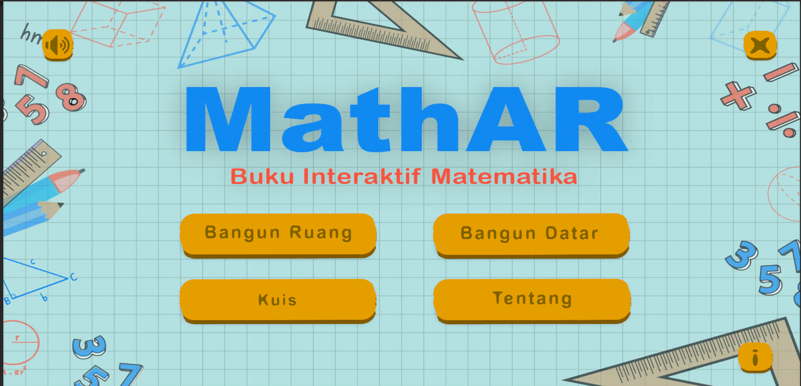
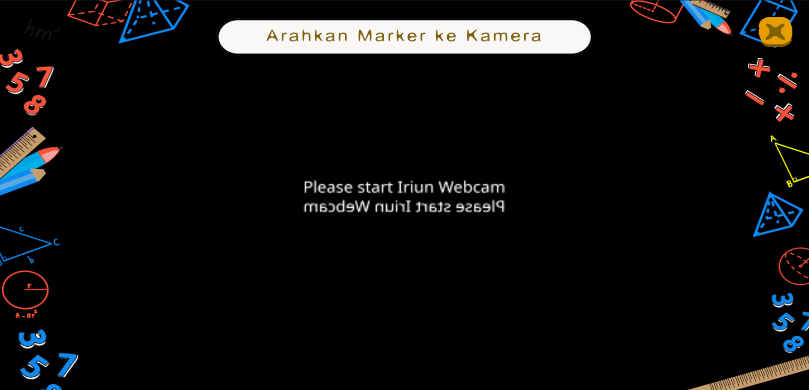
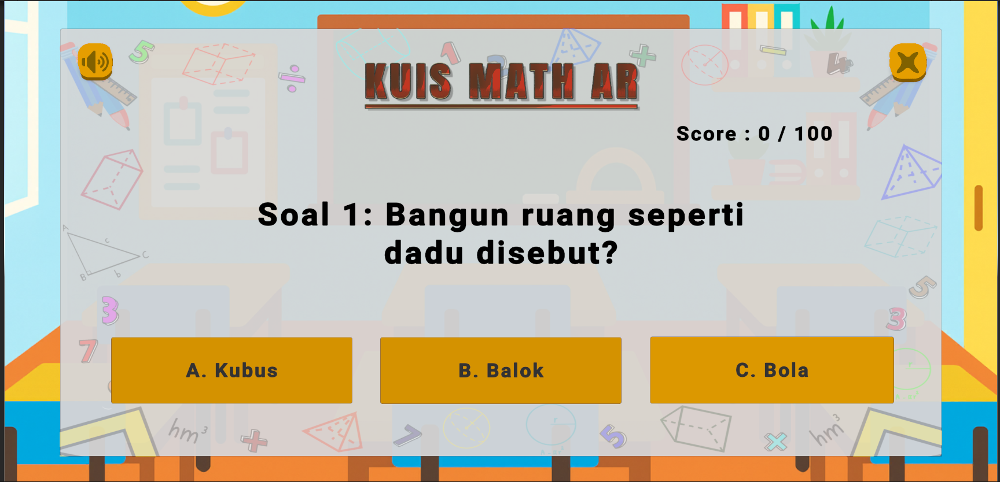
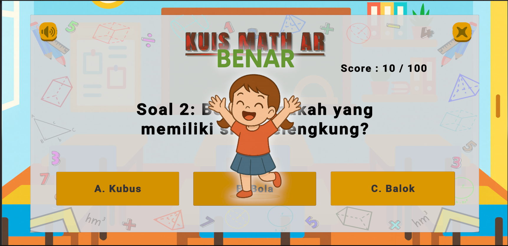
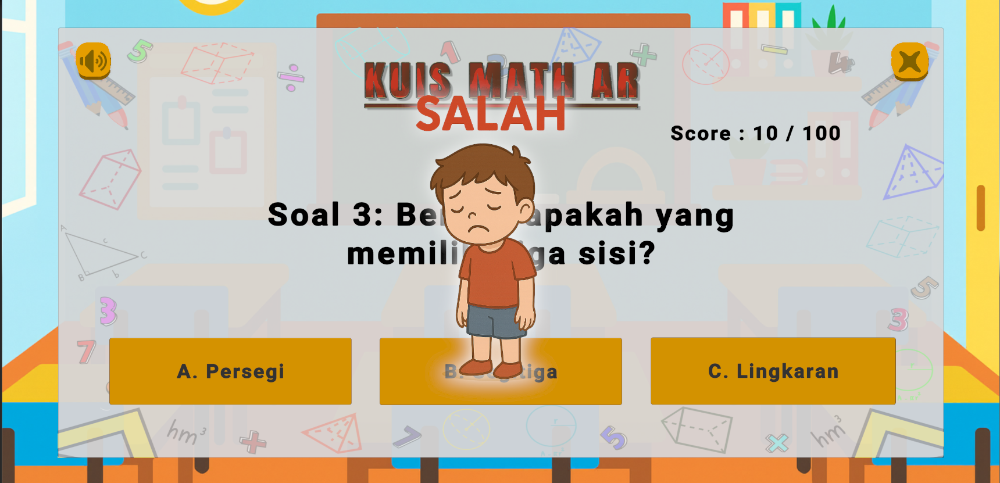
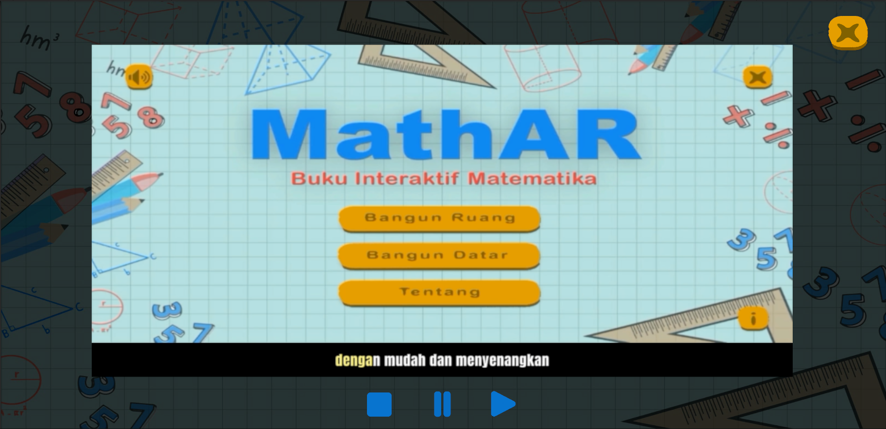

# 🧮 Math AR – Interactive Augmented Reality Math Learning App

An **Augmented Reality (AR)** educational game designed to help **elementary school students** learn geometry interactively through 3D visualization and quizzes.  
Developed with **Unity**, **Vuforia**, and **C#**, this app enhances conceptual understanding of **solid and flat shapes** using marker-based AR learning.

---

## 📖 Research Overview
Mathematics learning often becomes abstract and difficult to visualize for young learners.  
**Math AR** bridges this gap by combining traditional learning with **interactive Augmented Reality visualization**, allowing students to scan cards and view 3D models of geometric objects.

This research and application were developed using the **ADDIE model** (Analysis, Design, Development, Implementation, Evaluation).

---

## 🎯 Research Objectives
- Develop a **3D AR learning app** that visualizes geometric shapes (solid and flat).  
- Increase **student engagement and motivation** through interactive AR media.  
- Evaluate effectiveness using **expert validation and student testing**.  
- Improve comprehension of formulas, dimensions, and real-world geometric relations.

---

## 🧩 Key Features
- 🧊 **3D Object Visualization:** Scan markers to display 3D models of geometric objects.  
- 🧮 **Solid & Flat Geometry:** Learn about cubes, prisms, spheres, triangles, circles, and more.  
- 🧩 **Interactive Quiz System:** Adaptive multiple-choice quiz using JSON question sets.  
- 🎧 **Sound & Feedback System:** Audio and animated effects for correct/wrong answers.  
- 🧠 **Offline Learning:** Runs without internet for use in classrooms.  
- 🧾 **Formula Display:** Shows area, volume, perimeter, and surface data in real time.  

---

## ⚙️ System Architecture

📱 Math AR Application
│
├── menu.cs → Main menu navigation handler
├── bangunruang.cs → Scene controller for 3D solid shape lessons
├── bangundatar.cs → Scene controller for 2D flat shape lessons
├── QuestionManager.cs → Dynamic quiz system (JSON-based)
│
├── /Assets/Models/ → 3D shapes (cube, prism, cone, sphere, etc.)
├── /StreamingAssets/ → quiz_complete_abcd_shuffled.json
└── /Images/ → UI screenshots & storyboard


> 🧠 The system uses **SceneManager** for navigation, **Vuforia SDK** for AR marker tracking, and **TextMeshPro** for rendering question text and UI.

---

## 🧩 Core Scripts

### 🧭 menu.cs  
Handles all menu navigation and scene transitions.

```csharp
public class menu : MonoBehaviour {
   public void TombolKeluar() {
       Application.Quit();
       Debug.Log("Game Close");
   }

   public void loadbangunruang() => SceneManager.LoadScene("bangunruang");
   public void loadbangundatar() => SceneManager.LoadScene("bangundatar");
   public void loadtentangaplikasi() => SceneManager.LoadScene("tentangaplikasi");
   public void loadKuis() => SceneManager.LoadScene("Kuis");
}
```

> 🧠 The system uses **SceneManager** for navigation, **Vuforia SDK** for AR marker tracking, and **TextMeshPro** for rendering question text and UI.

---

## 🧩 Core Scripts

### 🧭 menu.cs  
Handles all menu navigation and scene transitions.

```csharp
public class menu : MonoBehaviour {
   public void TombolKeluar() {
       Application.Quit();
       Debug.Log("Game Close");
   }

   public void loadbangunruang() => SceneManager.LoadScene("bangunruang");
   public void loadbangundatar() => SceneManager.LoadScene("bangundatar");
   public void loadtentangaplikasi() => SceneManager.LoadScene("tentangaplikasi");
   public void loadKuis() => SceneManager.LoadScene("Kuis");
}
```
🎮 Acts as the navigation hub connecting 3D learning scenes, quiz modules, and info menus.


🧱 bangunruang.cs

Controls transitions between solid shape lessons (Bangun Ruang) scenes.

```csharp
public class bangunruang : MonoBehaviour {
   public void loadmenu() => SceneManager.LoadScene("menu");
   public void GoTorumuskubus() => SceneManager.LoadScene("rumuskubus");
   public void GoTorusukkubus() => SceneManager.LoadScene("rusukkubus");
   public void GoTorumusprisma() => SceneManager.LoadScene("rumusprisma");
   public void GoTorusukprisma() => SceneManager.LoadScene("rusukprisma");
}
```
🔹 Each function directs students to a specific lesson scene focused on volume, surface area, or edge count.


📐 bangundatar.cs

Handles navigation for flat shapes (Bangun Datar) lessons.

```csharp
public class bangundatar : MonoBehaviour {
   public void loadmenu() => SceneManager.LoadScene("menu");
   public void GoToklllingkaran() => SceneManager.LoadScene("klllingkaran");
   public void GoToluaslingkaran() => SceneManager.LoadScene("luaslingkaran");
   public void GoTositiklingkaran() => SceneManager.LoadScene("sitiklingkaran");
}
```
🧾 Students can learn perimeter, area, and vertices for each 2D shape interactively.


🧮 QuestionManager.cs

Core logic for loading, randomizing, and scoring quizzes dynamically from JSON.
```csharp
[System.Serializable]
public class QuestionData {
    public string question;
    public Dictionary<string, string> choices;
    public string correct;
}

public class QuestionManager : MonoBehaviour {
    public TextMeshProUGUI questionText;
    public List<Button> choiceButtons;
    public TextMeshProUGUI scoreText;
    private List<QuestionData> questions;
    private int score = 0;
    
    IEnumerator LoadQuestions() {
        string path = Path.Combine(Application.streamingAssetsPath, "quiz_complete_abcd_shuffled.json");
        string json = File.ReadAllText(path);
        questions = JsonConvert.DeserializeObject<List<QuestionData>>(json)
                    .OrderBy(q => Random.value).ToList();
        ShowQuestion();
    }

    void ShowQuestion() {
        QuestionData q = questions[0];
        questionText.text = q.question;
    }
}
```
🎯 Dynamically loads randomized quiz data, updates scores, and triggers result animations — improving learning retention through gamification.


## 🧠 ADDIE Research Framework

| Stage | Description |
|:------|:-------------|
| **Analysis** | Identified lack of engaging media in math learning for early students. |
| **Design** | Created AR-based storyboards, interface mockups, and learning flow diagrams. |
| **Development** | Implemented Unity scenes, C# logic, and Vuforia marker tracking. |
| **Implementation** | Field-tested at primary education level with 15 participants. |
| **Evaluation** | Expert validation and student feedback confirmed increased engagement and comprehension. |

---

## 📊 Evaluation & Testing Results

| Aspect | Expert Score | Student Response | Category |
|:--------|:--------------:|:----------------:|:---------:|
| Media Feasibility | 93% | 91% | Very Good |
| Material Relevance | 92% | 90% | Very Good |
| Engagement & Motivation | – | +34% improvement | Positive Impact |

> 📈 *Based on Likert-scale questionnaires and N-Gain analysis, AR-based learning increased student engagement by approximately **30–35%**.*

---

## 🎮 App Preview / Screenshots

| Scene | Description |
|:------:|-------------|
|  | 🏠 **Main Menu** – Displays the title screen and navigation options for AR Scan, Quiz, and About sections. |
|  | 📷 **AR Scan Scene** – Scans geometric shape markers and visualizes 3D objects in real-time. |
|  | 🧩 **Quiz Scene** – Presents interactive multiple-choice geometry questions. |
|  | ✅ **Correct Answer Feedback** – Displays positive feedback animation and sound when students answer correctly. |
|  | ❌ **Incorrect Answer Feedback** – Shows guidance and correction when the answer is wrong. |
|  | ℹ️ **About & Explanation Page** – Provides information about the app’s purpose and usage guide. |

> 🌐 *These visuals demonstrate how Math AR combines learning, interaction, and gamified education through AR-based visualization.*

---

## 🎬 Storyboard Flow

| Scene | Description |
|:------:|-------------|
| **Main Menu** | Entry screen for selecting learning mode (Bangun Datar, Bangun Ruang, or Quiz). |
| **AR Scan Scene** | Detects markers and displays 3D geometry (cube, sphere, prism, cone). |
| **Quiz Mode** | Students answer randomized AR-related math questions with feedback animation. |
| **Result Screen** | Displays total score, motivational message, and learning summary. |
| **About Page** | Provides background, app goals, and user guidance. |

<p align="center">
  
</p>

---

## 🧩 Key Findings

- AR visualization improved **conceptual clarity and spatial understanding** among students.  
- Interactive quizzes increased **motivation, curiosity, and active participation**.  
- Teachers reported improved **engagement and comprehension** in classroom trials.

---

## 🏁 Conclusion

**Math AR** successfully integrates **Augmented Reality, gamification, and pedagogy** to enhance mathematics learning for elementary students.  
By combining **3D visualization, adaptive quizzes, and real-world interactivity**, this project transforms traditional lessons into **immersive and enjoyable learning experiences**.

---

## 👨‍💻 Developer

**Arrizqi Pramadhana**  
🎓 *Politeknik Negeri Medan – D4 Multimedia Graphic Engineering Technology*  
📫 [arrizqipramadhana0710@gmail.com](mailto:arrizqipramadhana0710@gmail.com)  
🔗 [LinkedIn](https://linkedin.com/in/arrizqi-pramadhana)

---

© 2025 Arrizqi Pramadhana | Licensed under [CC BY 4.0](https://creativecommons.org/licenses/by/4.0/)


